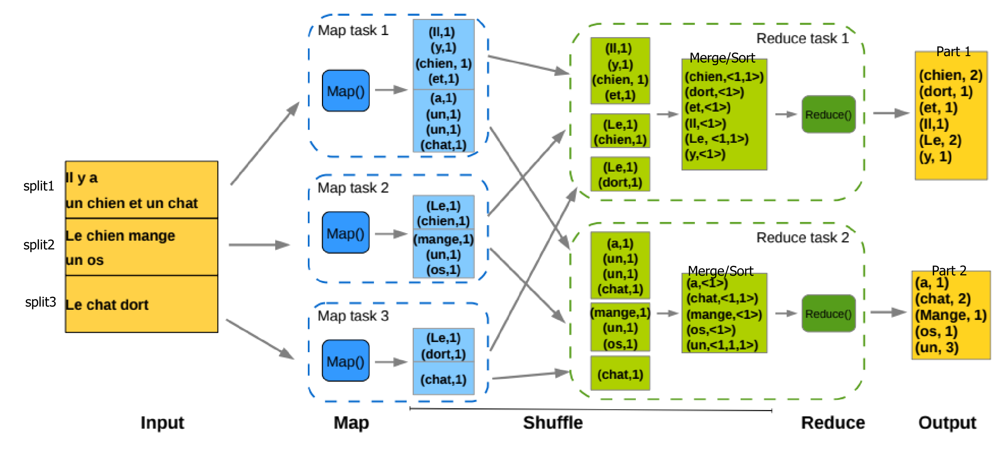
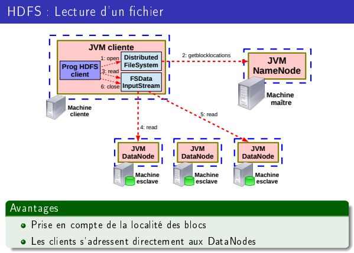
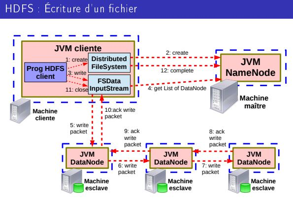

### 4 V du Big Data
  - Volume (traiter et stocker une grande masse de données)
  - Vélocité (vitesse très élevée de génération de données)
  - Variété (données structurées/non structurées sur des formats variés)
  - Véracité (assurer l'intégrité des données => obsolescence, justesse)

# MapReduce

  - transparent pour le programmeur
  - équilibrage de charge/ stockage et transfert de données

==> Le programmeur doit au **minimum fournir les fonctions map et reduce** pour que son programme fonctionne


### Map
  - lit des données d'entrées sous forme <clé,valeur>
  - Fait un traitement (exemple: extraire une info précise)
  - Produit des données de sorties sous forme <clé,valeur>
------------------------------------------------------------
  - chaque tâche map traite sa partie des données d'entrée appelé (**split**)
  - Chaque élément du split est associé à une clé de type K1
  - A chaque clé de type K1 lue depuis le split, la tâche map correspondante fait un appel à la fonction map().
  - La fonction map() produit dans le flux d'information une liste de <clé,valeur> intermédiaire de type <K2,V2>
  - **nombre de tâches de map = nombre de splits**
```
Map : (K1,V1) → list(K2,V2)
```


### Shuffle (phase intermédiaire)
  - Transfer, tri et fusionne les données entre les maps et les reduces
-----------------------------------------------
##### responsabilité des maps
  - stockage local partitionné des couples clé/valeur de sortie de map
  - **Partitionnement** : assignement déterministe des clés sur NbReduce partitions
  ⇒ une valeur de clé est associée à un unique reduce
##### responsabilité des reduces
- **copy**
  - téléchargement sur chaque map de la partition qui lui est associée
- **merge**
  - agrégation de l'ensemble des partitions téléchargées
  - agrégation des valeurs pour une clé donnée
- **sort**
  - tri des différentes clés déffinissant l'ordre de lecture par le reduce : ⇒ un ordre doit être défini pour chaque type de clé



### Reduce
  - Lit les données des maps via le shuffle sous la forme <clé,valeur>
  - Fait un traitement (exemple: somme, groupement, filtre)
  - Produit les données de sortie du calcul sous la forme de <clé,valeur>
--------------------------------------------
  - map terminée => agrégation en liste de toutes les valeurs intermédiaires de type V2 associées à une clé de type K2.
  - A chaque clé de type K2 la tache reduce correspondante fait un appel à la fonction reduce().
  - La fonction reduce() produit dans le flux d'info une liste de <clé,valeur> de type <K3,V3>
  - Chaque paire <K3,V3> émise est enregistrée dans l'ensemble de données de sortie
  - **Le nombre de tâche de reduces est défni a priori par l'utilisateur**
```
Reduce : (K2, list(V2)) → list(K3, V3)
Remarque : bien souvent K2 = K3
```


Wordcount exemple:
``` C
void Map(integer key, string value) {
//key : id of the line
//value : content of the line
for each word w in value {
Emit(w, 1);
}
}
void Reduce(string key, list of integer values) {
//key : a word
//value : a list of counter
integer count = 0;
for each v in values {
count += v;
}
Emit(key, count);
}
```

# Hadoop
- **Hadoop Map Reduce**
  - Une application exécutant des programmes Map-Reduce sur YARN.
  - Une API pour coder des programmes Map-Reduce
- **YARN**
  - Système d'ordonnancement et de gestion de ressources de cluster
- **Hadoop Distributed File System**
  - Système de fichiers distribué adapté aux gros volumes de données

## HDFS
**Système de fichiers distribué, tolérant aux pannes et conçu pour
stocker des fichiers massifs (> To).**

- Les fichiers sont **divisés en blocs de 128 Mo** (valeur par défaut)
  - ⇒ adapté aux gros fichiers
  - ⇒ inadapté au multitude de petits fichiers
- Mode 1 écriture/plusieurs lectures :
  - Lecture séquentielle
    - ⇒ on privilégie le débit à la latence
    - ⇒ la lecture d'une donnée implique une latence élevée
  - Écriture en mode append-only
    - ⇒ on ne peux pas modifier les données existantes d'un fichier
    - ⇒ impossible d'avoir plusieurs écrivains, ou de modifier un endroit arbitraire du fichier
-------------------------------------------------
###### archi maitre-esclave
  - la JVM maître HDFS : le **NameNode**
  - les JVM esclaves HDFS : les **DataNodes**

  - Stockage physique des blocs sur les FS locaux des Datanodes
  - Chaque bloc est répliqué **3 fois par defaut**
  - Les réplicas sont localisés sur des DataNodes différents

### NameNode
  - Gère l'allocation, la distribution et la réplication des blocs
  - Interface du HDFS avec l'extérieur
  - **Le nb de fichiers du HDFS est limité par la capacité mémoire du
NameNode**

### DataNode
  - Stocke des blocs de données dans le système de chier local
  - Serveur de bloc de données et de méta-données pour le client HDFS
  - Maintient des méta-données sur les blocs possédés (ex : CRC)
 

######  Communication avec le NameNode
- Heartbeat :
  - message-aller : capacité totale, espace utilisé/restant
  - message-retour : des commandes
    - copie de blocs vers d'autres Datanodes
    - invalidation de blocs
    - ...
- Informe régulièrement le Namenode des blocs contenus localement




## YARN
Service de gestion de ressources de calcul distribuées
  - architecture maître-esclaves
  - Gestion d'applications distribuées :
    - ⇒ Allocation/placement de containers sur les n÷uds esclaves
  - Une container = une abstraction de ressources de calcul :
    - ⇒ couple <nb processeurs, quantité mémoire>
    
Container Application Master(AM)
  - container maitre de l'application
  - négocie avec le RM l'allocation de containers esclaves

Container YarnChild (YC)
  - container esclave
  - execute une tache de l'application
  
[Schéma slide 35 cours hadoop]
  
 FIFO Scheduler
  - Les requêtes sont traitées dans l'ordre de leur arrivée (+ simple -partage cluster peu efficace)
 Capacity Scheduler
  - Plusieurs files d'attentes hiérarchiques avec une capacité max prédéfinie (+petite requêtes non pénalisées, - ttes ressources ne sont pas utilisées=
 Faire Scheduler
  -La capacité allouée à chaque client est la même (+alloc dynamique, pas d'attente, - capacité alloué à un job diminue avec la charge)
  

[schéma slide 43]

### Hadoop MapReduce: spéculation
  - Possibilité de démarrer de nouvelles instances de tâche en cours d'exécution
  - décision d'un lancement d'une spéculation est faite par l'AppMaster
  - Si la spéculation est jugée nécessaire, affectation d'une nouvelle instance de tâche dans un container
  -> Permet d'anticiper les tâches jugées trop lentes donc potentiellement défaillantes

___________________________________
# Spark

#### RDD (Resilient Distributed Dataset)

Un RDD est une collection de données :
  - typée
  - ordonnée (chaque élément a un index)
  - partitionnée sur un ensemble de machines
  - en lecture seule (immutabilité)
  - créée que par des opérations déterministes.
  - avec un niveau de persistance

#### RDD VS Distributed Shared Memory  
DSM: Un espace d'adressage global, où les applications lisent et écrivent de
manière aléatoire

Points forts RDD sur DSM:
- RDD ⇒ immutabilité :
  - ⇒ on ne peut que créer, pas modifier
  - ⇒ réplication de tâches et de données facilitées
- RDD ⇒ Écriture macros
  - ⇒Adapté pour l'écriture en bloc très utiles en Big Data
Points fort DSM sur RDD
  - DSM ⇒ mutabilité :
    - ⇒Adapté aux applications qui doivent mettre à jour un état partagé

`abstract class RDD[T] extends Serializable with Logging`


