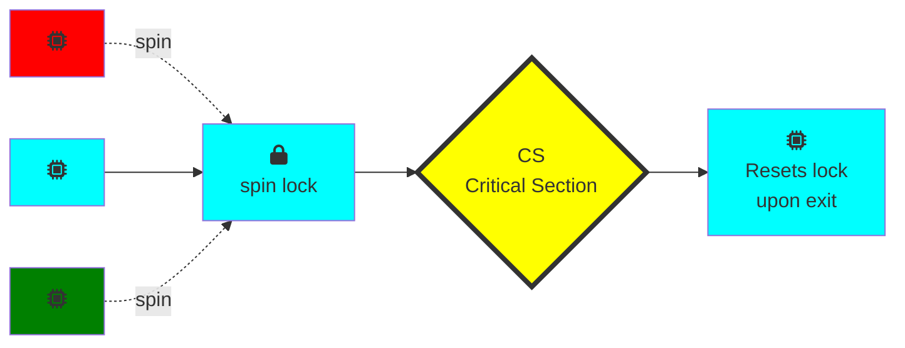
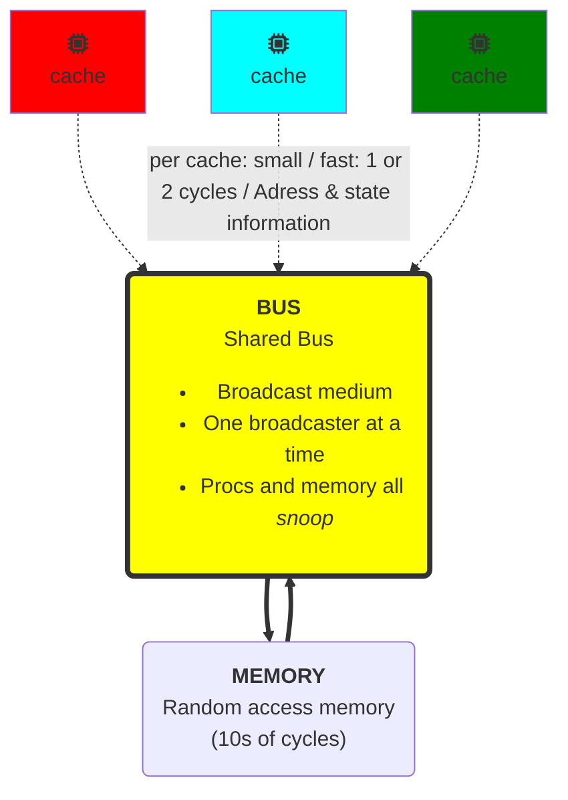
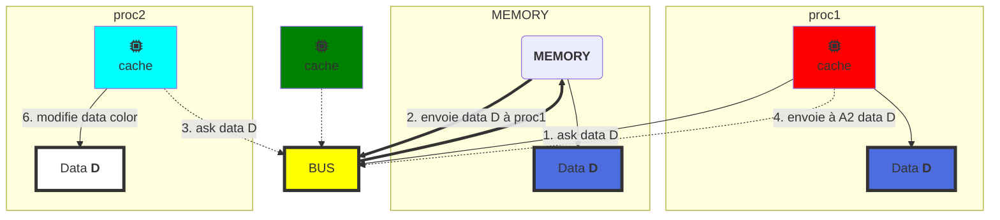
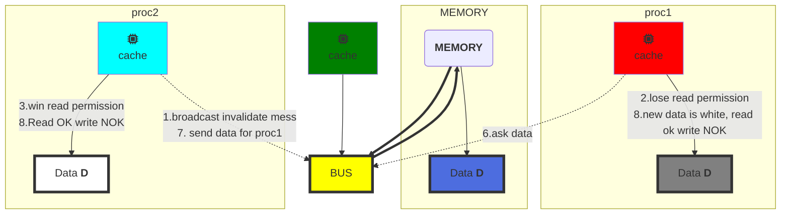

<!-- @import "[TOC]" {cmd="toc" depthFrom=1 depthTo=6 orderedList=false} -->
<!-- code_chunk_output -->

* [SPIN LOCK and Contention](#spin-lock-and-contention)
	* [Basic Spin-Lock](#basic-spin-lock)
		* [Test and Set ](#test-and-set-a-nametestandseta)
			* [Test and Set Locks](#test-and-set-locks)
			* [Space Complexity](#space-complexity)
			* [Performance](#performance)
		* [Test and Set and Set Locks](#test-and-set-and-set-locks)
		* [Bus-Based Architecture](#bus-based-architecture)
			* [Jargon](#jargon)
			* [Cave Canem](#cave-canem)
			* [Cache coherence](#cache-coherence)
			* [Write-Back Caches](#write-back-caches)
		* [Exclusion Mutuelle](#exclusion-mutuelle)
			* [Simple TASLock](#simple-taslock)
		* [Test-and-test-and-set](#test-and-test-and-set)
			* [Mesure du temps de mise au repos](#mesure-du-temps-de-mise-au-repos)
			* [Solution: Introduire un retardateur](#solution-introduire-un-retardateur)
		* [Anderson Queue Lock](#anderson-queue-lock)
		* [MCS LOCK](#mcs-lock)

<!-- /code_chunk_output -->

#SPIN LOCK and Contention
solution ->
- On essaye encore
  - "spin" ou "busy-wait" (on test en boucle le lock)
    - algo filter
    - algo bakery
  - bon si le delay est court
- Abandonner le processeur
  - bon si delay long
  - toujours bon pour un uniprocesseur

##Basic Spin-Lock


Un set de threads se bat pour le lock. Le cyan l'obtient et les autres tournent en attente (spin). Le gagnant (cyan) entre en section critique, fait son travail et release le lock a la sortie

**Problème** => la contention (trop de threads veulent le lock)


###Test and Set <a name="TestandSet"></a>
- TAS enregistre de manière atomique **true** dans un mot
- return la précédente value du mot et swap la value à **true** pour le mot courant.
- On peut reset le mot en ecrivant **false** dessus.
- (Java TaS = getAndSet)
- <kbd>interchangeably</kbd>

```Java
public class AtomicBoolean {
  boolean value;

  /*swap old and new value*/
  public synchronized AtomicBoolean
  getAndSet(boolean newValue){
    boolean prior = value;
    value = newValue;
    return prior;
  }
}
```

```Java
AtomicBoolean lock = new AtomicBoolean(false);
...
/*Swapping in true is called "test-and-set" or TAS*/
boolean prior = lock.getAndSet(true);
```

####Test and Set Locks
- Locking
  - lock libre -> value == false
  - lock pris -> value == true
- Obtenir lock en appelant TAS
  - Si result false ==> win
  - Si result true ==> lose
- Release lock en ecrivant false

```Java
class TASlock{
  /*Lock state is AtomicBoolean initialized to false*/
  AtomicBoolean state = new AtomicBoolean(false);

  void lock() {
    /*Keep trying until lock acquired*/
    while (state.getAndSet(true)) {}
  }

  void unlock() {
    /*Release lock by writing false in that word*/
    state.set(false);
  }
}
```

#### Space Complexity
- TAS spin-lock a une petite empreinte (réduit à une constante linéaire)
- N thread spin-lock utilisent O(1) d'espace
- A l'opposé du O(n) de *Peterson/Bakery*
- Comment dépasser la limite inférieure Ω(n)?
  - En utilisant l'opération <kbd>RMW</kbd>...

#### Performance
- Experience:
  - n threads
  - Compteur partagé incrémenté 1 million de fois
- Combien de temps cela devrait-il prendre?
- Combien de temps cela prend-t-il?  

/*voir pour inserer des courbes ici (slide 29 cours 2)*/

###Test and Set and Set Locks

- Lurking state (Etat "caché")
  - Attendre que le lock "ai l'air" libre
  - Tourner tant que le read return **true** (lock pris)
- Pouncing state (Etat "Bondissant")
  - Dès que le verrou "a l'air" disponible
  - Lire le retour **false** (lock free)
  - Appeler TAS pour obtenir le verrou
  - Si TAS perd, retour en état "lurking"

  ```Java
  class TTASlock{

    AtomicBoolean state = new AtomicBoolean(false);

    void lock() {
      while (true){
        /*Attend que le lock ai l'air libre*/
        while (state.get()) {}
          /*
          * Dès qu'il a l'air libre, on essaie de l'obtenir
          * Si quelqu'un d'autre l'obtient avant nous, on retourne
          * a l'état de "lurking" et on reprend la lecture de la variable
          */
          if (!state.getAndSet(true))
            return;
      }
    }
  }
  ```

//ajouter courbe slide 35 cours 2
TTAS lock beaucoup plus performant que TAS mais toujours bien pire que le lock ideal attendu.

TTAS beaucoup plus efficace que TAS alors qu'il fonctionne de la même manière dans notre modèle: pourquoi?

###Bus-Based Architecture
Modèle simplifié (il existe des modèles a plusieurs niveaux de cache)

#### Jargon
- <kbd>Cache hit</kbd> Le processuer a trouvé la donnée dans son cache sans avoir à faire tout le chemin vers la mémoire.
-  <kbd>Cache miss</kbd> Le processeur n'a pas trouvé ce qu'il cherchait dans le cache ==> cher en temps

#### Cave Canem
Modèle simplifié

1. proc1 broadcast un message sur le bus demandant à quelqu'un si il a la data D de couleur "bleu" dont il a besoin
2. seul le bus possède la data D, il la transmet à proc1
3. proc2 broadcast une demande de la même data D sur le bus
4. proc1 a la data D en cache, il lui transmet
5. proc1 et proc2 ont la même data D en Cache
6. proc2 modifie la data D dans son cache (de "bleu" à "blanc")
7. **probleme** => D "bleu" en cache de proc1 et en mémoire sont maintenant différentes de D "blanc" en cache de proc2




#### Cache coherence
Le fait de garder une trace de copies multiples d'une même data est appelé *cache coherence problem*

#### Write-Back Caches

>3 status pour le Cache:
><kbd>Invalid:</kbd> contient "*raw seething bits*" "dénué de sens"
><kbd>Valid</kbd>: On peut lire mais pas écrire
><kbd>Dirty</kbd>: La donnée a été modifiée
>>Intercept les autres requetes de chargement
>>On écrit en retour sur la mémoire avant d'utiliser le cache

Reprenons à l'étape 6 : proc2 modifie la data D dans son cache (de "bleu" à "blanc")
1. proc2 broadcast un "*invalidation message*" prevenant les autres processeurs d'invalider ou desactiver leur version en cache de la donnée
2. proc1 capte le broadcast et set son cache en **Invalid State**
3. Le cache de proc2 obtient des droits d'écriture, le cache de proc1 perd ses droits de lecture.
4. A ce point, on réduit le traffic bus car on sait que proc2 a la seule copie en cache => beaucoup plus efficace qu'un "*write-through cache*"
5. Pas besoin d'update la memoire avant que le processeur ne veuillent utiliser cet espace memoire pour autre chose. Si un autre proc a besoin de la data, il l'obtiendra de proc2
6. proc1 demande la data au travers du bus
7. proc2 envoie la data a proc1
8. proc1 obtient les droits de lectures mais pas d'écriture.




### Exclusion Mutuelle

Besoins pour optimiser?
* bande passante de bus utilisée par les threads tournants (spin)
* Relacher/Acquerir latence
* Acquerir latence pour les idle lock

#### Simple TASLock

* TAS invalide les lignes de Cache
* Spinners
  - Miss dans Cache
  - Go to bus
* Thread veut relacher LOCK
  - différé derrière spinner

On considère desormais comment l'algo simple du TAS fonctionne en utilisant un cache de réecriture basé sur le bus. Chaque appel TAS passe sur le bus, tous les threads en attente passent continuellement sur le bus, tous les autres doivent attendre pour utiliser le bus à chaque accès mémoire.
Pire: TAS invalide toutes les copies en cache du verrou, chaque spin tkread fait donc un cache miss presque à chaque fois et doit utiliser le bus pour get la nouvelle valeur non modifiée.
Pompon: le thread tenant le verrou peut être retardé en  attendant d'utiliser le bus qui est monopolisé par les spinners.
Il est donc logique que les performances de TAS soient si faibles.

### Test-and-test-and-set

* Attends jusqu'à ce que le lock "ai l'air" libre
  - Spin sur un cache local
  - Pas d'utilisation du bus pendant que le lock est pris
* Problem: quand le lock est relaché
  - tempête d'invalidations

On considère maintenant le comportement de TAS pendant que le verrou est tenu par un thread A.
Thread B lit le verrou (1ere fois) -> cache miss -> B se bloque pendant que la valeur est chargée dans son cache.
A détient le verrou -> B relit plusieurs fois la valeur, a chaque fois B hits dans son cache.
B ne produit pas de trafic bus et ne ralentit pas les accès mémoire des autres threads.
Un thread qui libère un verrou n'est pas retardé par les spin threads sur ce verrou.

**Problèmes**
* Si tout le monde miss
  - lecture satisfaite sequentiellement
* Tout le monde fait un TAS
  - Invalide le cache des autres
* Eventuellement mis au repos après l'aquisition du LOCK
  - Combien de temps cela prends-t-il?

#### Mesure du temps de mise au repos

**X** = temps des operations n'utilisant pas le bus
**Y** = temps des operations en cause d'un traffic intense sur le bus

En SC, on run **X** puis **Y**. Aussi longtemps que le temps de mise au repos est plus petit que **X**, il n'y a pas de chute de performance.
Si on fait varier graduellement **X**, on peut determiner le temps exact de mise au repos.  

[slide 78 courbe Quiescence Time]
Augmentation linéaire avec le nombre de processeurs sur l'archi bus. (temps en fonction du nb de threads)

[slide 79 courbe TAS / TTAS / Ideal]

#### Solution: Introduire un retardateur
* Si le lock a l'air libre
  - Mais j'echoue à l'avoir
* Il devrait y avoir beaucoup de contention
  - Mieux de se retirer plutôt que collide encore

Si on n'arrive pas a obtenir un lock qui a l'air libre, on se retracte et attends un petit peu que les choses se calment.  

**Exponential Backoff**
Si on echoue a obtenir le lock:
* on attends une durée aléatoire avant de reessayer
* A chaque echec on double l'attente

```java
public class Backoff implements lock{
  public void lock() {
    int delay = MIN_DELAY; /* on fixe le delay minimum*/
    while (true) {
      while (state.get()){} /*On attends que le locks ai l'air libre*/
      if (! lock.getAndSet(true)) /*si on gagne, on return*/
        return;
      sleep(random() % delay); /*on se retire pour une durée random*/
      if (delay < MAX_DELAY) /*On double le delay*/
        delay = 2 * delay;
    }
  }
}
```

[slide 88 spin-wainting overhead]

**Backoff**
* Bien
  - Facile à implementer
  - Bat le TTAS lock


* Mauvais
  - Doit choisir les parametres prudement
  - Non portable sur plusieurs platformes

La durée du delais est un élément critique à choisir. La performance de l'algo est impactée par le nombre de processeurs et leur vitesse. Il est  donc dur de rendre portable le code au travers d'une gamme de différentes machines.

**Idées**
* Eviter les Invalidations inutiles
  - En gardant une queue de threads
* Chaque thread
  - Notifie le suivant dans la ligne
  - Sans ennuyer les autres

### Anderson Queue Lock

```ditaa {cmd=true args=["-E"]}
Etape1: Proc1 demande le lock
        il est le premier il obtient la case 1

        acquiring
          /-----+
+----+    |cC02 |
|next|    |Proc1|->getAndIncrement
+----+    +-----/
  |
  v
+----+---+---+---+---+
|c1FF|   |   |   |   |  flags
| T  | F | F | F | F |
+----+---+---+---+---+

Etape2: Le slot1 est utilise par proc1,
        le next avance pour le proc suivant

          acquired            acquiring
          /-----+             /-----+
+----+    |cC02 |             |cFD8 |
|next|    |Proc1|->mine!      |Proc2|
+----+    +-----/             +-----/
  |
  \----\
       |
       v
+----+---+---+---+---+
|cC02|   |   |   |   |  flags
| T  | F | F | F | F |
+----+---+---+---+---+

Etape3: proc2 demande le lock puis se met en attente

          acquired            acquiring
          /-----+             /-----+
+----+    |cC02 |             |cFD8 |
|next|    |Proc1|->mine!      |Proc2|->getAndIncrement
+----+    +-----/             +-----/
  |
  \---------\
            |
            v
+----+----+---+---+---+
|cC02|cFD8|   |   |   |  flags
| T  | F  | F | F | F |
+----+----+---+---+---+

Etape4: Proc1 release le lock, flag[i+1] true

          released            acquired
          /-----+             /-----+
+----+    |cC02 |             |cFD8 |
|next|    |Proc1|             |Proc2|->mine!
+----+    +-----/             +-----/
  |
  \---------\
            |
            v
+----+----+---+---+---+
|cC02|cFD8|   |   |   |  flags
| T  | T  | F | F | F |
+----+----+---+---+---+

```

```java
class ALock implements Lock{
  boolean[] flags={true,false,...,false}; /*Un flag par thread*/
  AtomicInteger next = new AtomicInteger(0); /* prochain flag a utiliser*/
  ThreadLocal<Integer> mySlot; /*Thread local variable*/
}

public lock(){
  mySlot = next.getAndIncrement(); /*Prend le next slot*/
  while(!flags[mySlot % n]){}; /* spin until told to go*/
  flags[mySlot % n] = false; /*prepare slot for re-use*/
}

public unlock(){
  flags[(mySlot+1) % n] = true; /*tell next thread to go*/
}
```

[slide 110 performance]
Beaucoup plus efficace que TTAS

* Bien
  - Premier vrai lock scalable
  - Simple et facile à implementer
* Mauvais
  - Space hog
  - Un bit par thread
    - Si on ne connait pas le nombre de threads?
    - Petit nombre de prétendants réels?

###MCS LOCK
* Fifo
* Spin sur la mémoire locale seulement
* Petit, taille constante


```ditaa {cmd=true args=["-E"]}
Initialement

      idle
    /-----+
    |cC02 |
    |Proc1|
    +-----/

+-------+    +-----+----+
|c1AB   | -> |c1AB |c1AB|->...
| Tail  |    |False|    |
+-------+    +-----+----+


Acquiring

    acquiring
      /-----+
      |cC02 |
      |Proc1|
      +-----/    (allocate Qnode)
          ^        +-----+----+
          :        |cC02 |cC02|->...
    /-----/        | true|    |  
    | swap         +-----+----+            
    v
+-------+    +-----+----+
|c1AB   | -> |c1AB |c1AB|->...
| Tail  |    |False|    |
+-------+    +-----+----+


Acquiring

      acquired
      /-----+
      |cC02 |
      |Proc1|---\
      +-----/   |
                |         +-----+----+
                |         |cC02 |cC02|->...
                |         | true|    |
                |         +-----+----+
                v             ^
+-------+    +-----+----+     |
|c1AB   |    |c1AB |c1AB|->...|
| Tail  |    |False|    |     |
+-------+    +-----+----+     |
    |                         |
    \-------------------------/

  Acquired

      acquired
      /-----+
      |cC02 |
      |Proc1|---\
      +-----/   |
                :         +-----+----+
                |         |cC02 |cC02|->...
                |         | true|    |
                |         +-----+----+                             
                v          ^   ^
+-------+    +-----+----+  |   |
|c1AB   |    |c1AB |c1AB|--/   |
| Tail  |    |False|    |      |
+-------+    +-----+----+      |
      |                        |
      \------------------------/

Acquiring
    acquired          acquiring
      /-----+           /-----+         
      |cC02 |           |cFD8 |
      |Proc1|           |Proc2|
      +-----/           +-----/
                          +-----+----+
                          |cC02 |cC02|->...
                          |false|    |
                          +-----+----+   
+-------+                   ^  +----+----+  
|c1AB   |        swap       :  |cFD8|cFD8|->...
| Tail  | ------------------/  |true|    |
+-------+                      +----+----+

Acquiring
    acquired          acquiring
      /-----+           /-----+         
      |cC02 |           |cFD8 |-----\
      |Proc1|           |Proc2|     :
      +-----/           +-----/     v
                          +-----+----+
                          |cC02 |cC02|->...
                          |false|    |
                          +-----+----+   
+-------+                      +----+----+  
|c1AB   |                      |cFD8|cFD8|->...
| Tail  | -------------------->|true|    |
+-------+                      +----+----+   

Acquiring
    acquired          acquiring
      /-----+           /-----+         
      |cC02 |           |cFD8 |-----\
      |Proc1|           |Proc2|     :
      +-----/           +-----/     v
                          +-----+----+
                          |cC02 |cC02|-\
                          |false|    | |
                          +-----+----+ v   
+-------+                      +----+----+  
|c1AB   |                      |cFD8|cFD8|->...
| Tail  | -------------------->|true|    |
+-------+                      +----+----+     

Acquiring
    acquired          acquiring
      /-----+           /-----+  YEAH!     
      |cC02 |           |cFD8 |
      |Proc1|           |Proc2|
      +-----/           +-----/
           |                +-----+----+
           :                |cC02 |cC02|-\
           |                |true |    | |
           |                +-----+----+ v   
           |              
+-------+  |    false          +-----+----+  
|c1AB   |  \------------------>|cFD8 |cFD8|->...
| Tail  | -------------------->|false|    |
+-------+                      +-----+----+            

```

```java
class MCSLock implements Lock{
  AtomicReference tail;
  public void lock(){
    Qnode qnode = new Qnode(); /* Make a QNode*/
    Qnode pred = tail.getAndSet(qnode); /*Add my Node to the tail of queue*/
    if (pref != null){ /*fix if queue was non-empty*/
      qnode.locked = true;
      pred.next = qnode;
      while (qnode.locked) {}/*wait until unlocked*/
    }
  }

  public void unlock(){
    if (qnode.next == null){ /* Missing successor?*/
      if (tail.CAS(qnode, null))  /*If really no successor, return*/
        return;
      while (qnode.next == null){} /*wait for successor to catch up*/
    }
    qnode.next.locked = false; /* Pass lock to successor*/
  }
}
```
