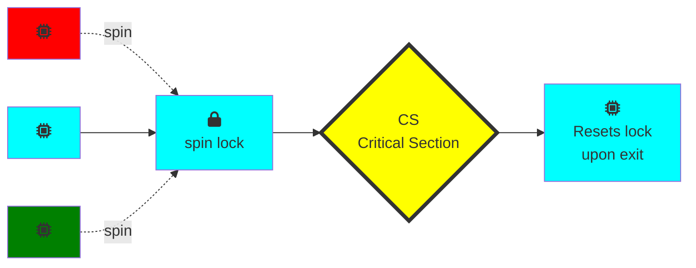
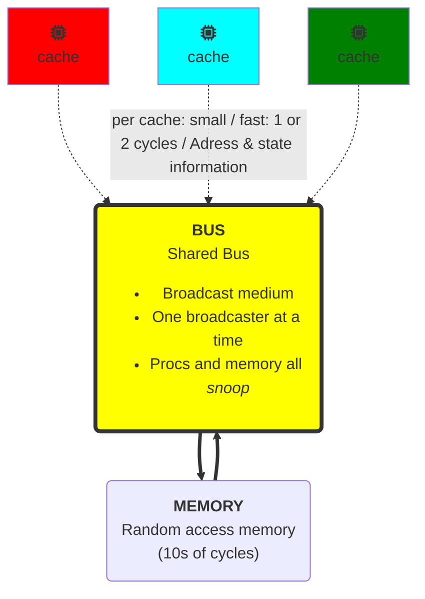
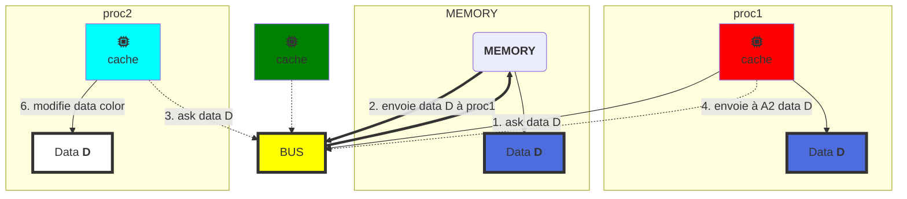
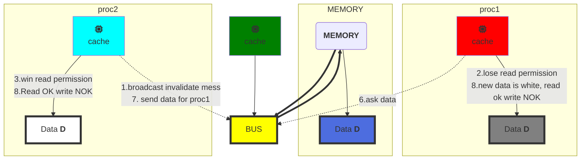

#SPIN LOCK and Contention

##LOCK
solution ->
- On essaye encore
  - "spin" ou "busy-wait" (on test en boucle le lock)
    - algo filter
    - algo bakery
  - bon si le delay est court
- Abandonner le processeur
  - bon si delay long
  - toujours bon pour un uniprocesseur

###Basic Spin-Lock


Un set de threads se bat pour le lock. Le cyan l'obtient et les autres tournent en attente (spin). Le gagnant (cyan) entre en section critique, fait son travail et release le lock a la sortie

**Problème** => la contention (trop de threads veulent le lock)


####Test and Set
- TAS enregistre de manière atomique **true** dans un mot
- return la précédente value du mot et swap la value à **true** pour le mot courant.
- On peut reset le mot en ecrivant **false** dessus.
- (Java TaS = getAndSet)
- <kbd>interchangeably</kbd>

```Java
public class AtomicBoolean {
  boolean value;

  /*swap old and new value*/
  public synchronized AtomicBoolean
  getAndSet(boolean newValue){
    boolean prior = value;
    value = newValue;
    return prior;
  }
}
```

```Java
AtomicBoolean lock = new AtomicBoolean(false);
...
/*Swapping in true is called "test-and-set" or TAS*/
boolean prior = lock.getAndSet(true);
```

####Test and Set Locks
- Locking
  - lock libre -> value == false
  - lock pris -> value == true
- Obtenir lock en appelant TAS
  - Si result false ==> win
  - Si result true ==> lose
- Release lock en ecrivant false

```Java
class TASlock{
  /*Lock state is AtomicBoolean initialized to false*/
  AtomicBoolean state = new AtomicBoolean(false);

  void lock() {
    /*Keep trying until lock acquired*/
    while (state.getAndSet(true)) {}
  }

  void unlock() {
    /*Release lock by writing false in that word*/
    state.set(false);
  }
}
```

##### Space Complexity
- TAS spin-lock a une petite empreinte (réduit à une constante linéaire)
- N thread spin-lock utilisent O(1) d'espace
- A l'opposé du O(n) de *Peterson/Bakery*
- Comment dépasser la limite inférieure Ω(n)?
  - En utilisant l'opération <kbd>RMW</kbd>...

##### Performance
- Experience:
  - n threads
  - Compteur partagé incrémenté 1 million de fois
- Combien de temps cela devrait-il prendre?
- Combien de temps cela prend-t-il?  

/*voir pour inserer des courbes ici (slide 29 cours 2)*/

####Test and Set and Set Locks
- Lurking state (Etat "caché")
  - Attendre que le lock "ai l'air" libre
  - Tourner tant que le read return **true** (lock pris)
- Pouncing state (Etat "Bondissant")
  - Dès que le verrou "a l'air" disponible
  - Lire le retour **false** (lock free)
  - Appeler TAS pour obtenir le verrou
  - Si TAS perd, retour en état "lurking"

  ```Java
  class TTASlock{

    AtomicBoolean state = new AtomicBoolean(false);

    void lock() {
      while (true){
        /*Attend que le lock ai l'air libre*/
        while (state.get()) {}
          /*
          * Dès qu'il a l'air libre, on essaie de l'obtenir
          * Si quelqu'un d'autre l'obtient avant nous, on retourne
          * a l'état de "lurking" et on reprend la lecture de la variable
          */
          if (!state.getAndSet(true))
            return;
      }
    }
  }
  ```

//ajouter courbe slide 35 cours 2
TTAS lock beaucoup plus performant que TAS mais toujours bien pire que le lock ideal attendu.

TTAS beaucoup plus efficace que TAS alors qu'il fonctionne de la même manière dans notre modèle: pourquoi?

####Bus-Based Architecture
Modèle simplifié (il existe des modèles a plusieurs niveaux de cache)

#### Jargon
- <kbd>Cache hit</kbd> Le processuer a trouvé la donnée dans son cache sans avoir à faire tout le chemin vers la mémoire.
-  <kbd>Cache miss</kbd> Le processeur n'a pas trouvé ce qu'il cherchait dans le cache ==> cher en temps

#### Cave Canem
Modèle simplifié

1. proc1 broadcast un message sur le bus demandant à quelqu'un si il a la data D de couleur "bleu" dont il a besoin
2. seul le bus possède la data D, il la transmet à proc1
3. proc2 broadcast une demande de la même data D sur le bus
4. proc1 a la data D en cache, il lui transmet
5. proc1 et proc2 ont la même data D en Cache
6. proc2 modifie la data D dans son cache (de "bleu" à "blanc")
7. **probleme** => D "bleu" en cache de proc1 et en mémoire sont maintenant différentes de D "blanc" en cache de proc2




#### Cache coherence
Le fait de garder une trace de copies multiples d'une même data est appelé *cache coherence problem*

##### Write-Back Caches

>3 status pour le Cache:
><kbd>Invalid:</kbd> contient "*raw seething bits*" "dénué de sens"
><kbd>Valid</kbd>: On peut lire mais pas écrire
><kbd>Dirty</kbd>: La donnée a été modifiée
>>Intercept les autres requetes de chargement
>>On écrit en retour sur la mémoire avant d'utiliser le cache

Reprenons à l'étape 6 : proc2 modifie la data D dans son cache (de "bleu" à "blanc")
1. proc2 broadcast un "*invalidation message*" prevenant les autres processeurs d'invalider ou desactiver leur version en cache de la donnée
2. proc1 capte le broadcast et set son cache en **Invalid State**
3. Le cache de proc2 obtient des droits d'écriture, le cache de proc1 perd ses droits de lecture.
4. A ce point, on réduit le traffic bus car on sait que proc2 a la seule copie en cache => beaucoup plus efficace qu'un "*write-through cache*"
5. Pas besoin d'update la memoire avant que le processeur ne veuillent utiliser cet espace memoire pour autre chose. Si un autre proc a besoin de la data, il l'obtiendra de proc2
6. proc1 demande la data au travers du bus
7. proc2 envoie la data a proc1
8. proc1 obtient les droits de lectures mais pas d'écriture.



